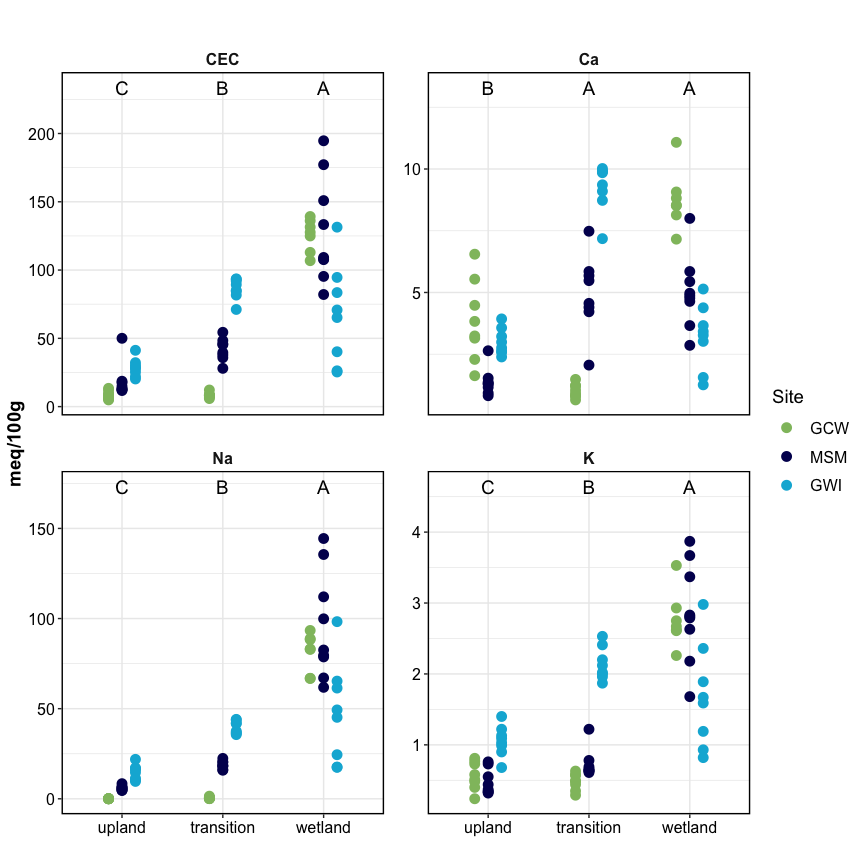
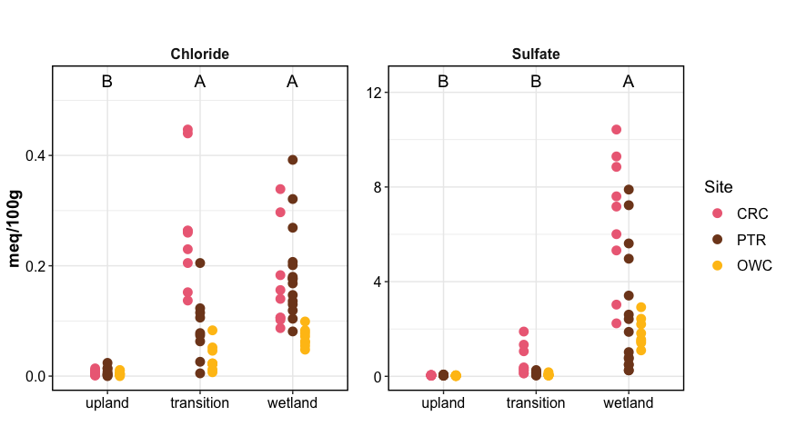
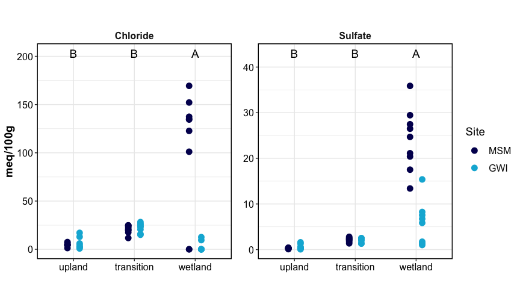
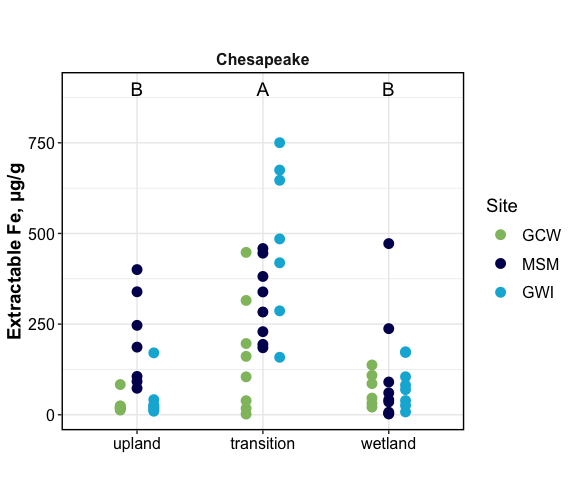
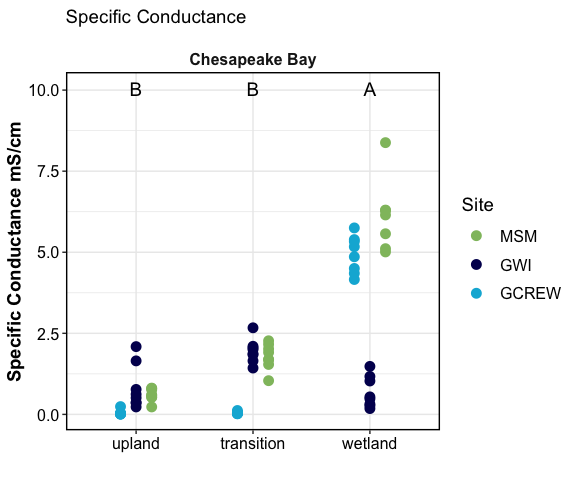
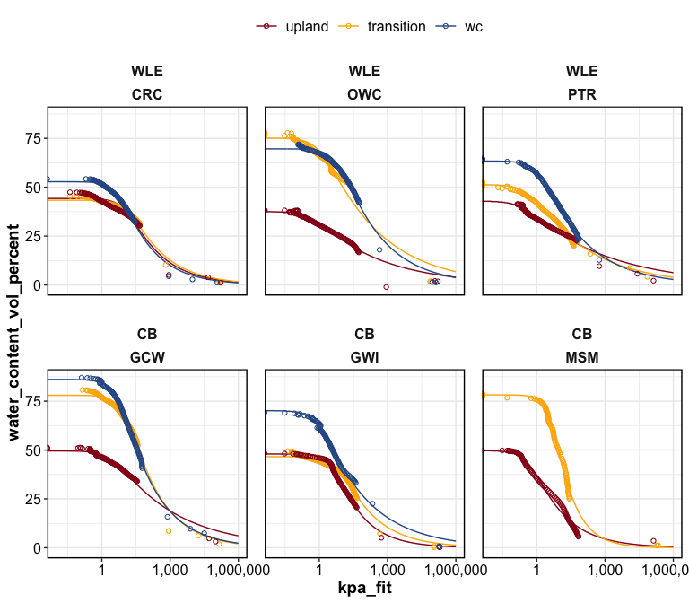

Synpotic Soil Characterization
================

------------------------------------------------------------------------

## OVERALL SUMMARIES

### Analysis completion matrix

click to open

Number of reps available per analysis. Most were 8-9 reps, but some
(e.g. WLE B-horizons) had fewer reps.

| region     | site | transect   | horizon | DIN | Ferrozine | GWC |  IC | ICP | LOI | Mehlich3 | NPOC |  PH | TCTNTS | DIC |
|:-----------|:-----|:-----------|:--------|----:|----------:|----:|----:|----:|----:|---------:|-----:|----:|-------:|----:|
| Erie       | CRC  | upland     | A       |   9 |         9 |   9 |   9 |   9 |   9 |        9 |    9 |   9 |      9 |   9 |
| Erie       | CRC  | transition | A       |   9 |         9 |   9 |   9 |   9 |   9 |        9 |    9 |   9 |      9 |   9 |
| Erie       | CRC  | wetland    | A       |   9 |         8 |   9 |   9 |   9 |   9 |        9 |    9 |   9 |      9 |   9 |
| Erie       | PTR  | upland     | A       |   9 |         9 |   9 |   9 |   9 |   9 |        6 |    9 |   9 |      9 |   9 |
| Erie       | PTR  | transition | A       |   9 |         9 |   9 |   9 |   9 |   9 |        9 |    9 |   9 |      9 |   9 |
| Erie       | PTR  | wetland    | A       |  15 |        15 |  15 |  15 |  15 |  15 |       15 |   15 |  15 |     15 |  15 |
| Erie       | OWC  | upland     | A       |   9 |         9 |   9 |   9 |   9 |   9 |        9 |    9 |   9 |      9 |   8 |
| Erie       | OWC  | transition | A       |   9 |         9 |   9 |   9 |   9 |   9 |        9 |    9 |   9 |      8 |   9 |
| Erie       | OWC  | wte        | A       |   9 |         9 |   9 |   9 |   9 |   9 |        9 |    9 |   9 |      9 |   9 |
| Erie       | OWC  | wetland    | A       |   8 |         7 |   8 |   8 |   8 |  NA |        8 |    8 |   8 |      8 |   8 |
| Chesapeake | GCW  | upland     | A       |   8 |         8 |   8 |   8 |   8 |   8 |        8 |    8 |   8 |      8 |  NA |
| Chesapeake | GCW  | transition | A       |   8 |         8 |   8 |   8 |   8 |   8 |        8 |    8 |   8 |      8 |  NA |
| Chesapeake | GCW  | wetland    | A       |   8 |         6 |   8 |   8 |   7 |   8 |        8 |    8 |   8 |      7 |  NA |
| Chesapeake | MSM  | upland     | O       |   8 |         7 |   8 |   8 |   8 |   8 |        7 |    8 |   8 |      8 |   8 |
| Chesapeake | MSM  | transition | O       |   8 |         8 |   8 |   8 |   8 |   8 |        8 |    8 |   8 |      7 |   8 |
| Chesapeake | MSM  | wetland    | O       |   9 |         9 |   9 |   9 |   9 |   9 |        9 |    9 |   9 |      9 |   9 |
| Chesapeake | GWI  | upland     | O       |   8 |         8 |   9 |   8 |   8 |   8 |        8 |    8 |   8 |      8 |   8 |
| Chesapeake | GWI  | transition | O       |   8 |         7 |   8 |   8 |   8 |   8 |        8 |    8 |   8 |      5 |   8 |
| Chesapeake | GWI  | wetland    | O       |   8 |         8 |   8 |   8 |   8 |   8 |        8 |    8 |   8 |      8 |   8 |

### Overall trends - PCAs and Correlations

click to open

**PCAs**

<!-- -->

<!-- -->

**CORRELATIONS**

<!-- -->

<!-- -->

------------------------------------------------------------------------

## EACH ANALYSIS

### figures for manuscript

click to open

<!-- -->

<!-- -->

<!-- -->

<!-- -->

<!-- -->

<!-- -->

<!-- -->

### by transect

click to open

    ## $gg_gwc

<!-- -->

    ## 
    ## $gg_ph

<!-- -->

    ## 
    ## $gg_sp_conduc

<!-- -->

    ## 
    ## $gg_tc

<!-- -->

    ## 
    ## $gg_tn

<!-- -->

    ## 
    ## $gg_cn

<!-- -->

    ## 
    ## $gg_ts

<!-- -->

    ## 
    ## $gg_loi

<!-- -->

    ## 
    ## $gg_weoc

<!-- -->

    ## 
    ## $gg_din_nh4n

<!-- -->

    ## 
    ## $gg_din_no3n

<!-- -->

    ## 
    ## $gg_icp_ca

<!-- -->

    ## 
    ## $gg_icp_mg

<!-- -->

    ## 
    ## $gg_icp_na

<!-- -->

    ## 
    ## $gg_icp_k

<!-- -->

    ## 
    ## $gg_icp_al

<!-- -->

    ## 
    ## $gg_icp_cec

<!-- -->

    ## 
    ## $gg_p_mehlich

<!-- -->

    ## 
    ## $gg_ferr_fetotal

<!-- -->

    ## 
    ## $gg_ions_cl

<!-- -->

    ## 
    ## $gg_ions_so4

<!-- -->

### by site - OA horizons

click to open

    ## $gg_gwc

<!-- -->

    ## 
    ## $gg_ph

<!-- -->

    ## 
    ## $gg_sp_conduc

<!-- -->

    ## 
    ## $gg_tc

<!-- -->

    ## 
    ## $gg_tn

<!-- -->

    ## 
    ## $gg_ts

<!-- -->

    ## 
    ## $gg_loi

<!-- -->

    ## 
    ## $gg_weoc

<!-- -->

    ## 
    ## $gg_din_nh4n

<!-- -->

    ## 
    ## $gg_din_no3n

<!-- -->

    ## 
    ## $gg_icp_ca

<!-- -->

    ## 
    ## $gg_icp_mg

<!-- -->

    ## 
    ## $gg_icp_na

<!-- -->

    ## 
    ## $gg_icp_k

<!-- -->

    ## 
    ## $gg_icp_al

<!-- -->

    ## 
    ## $gg_icp_cec

<!-- -->

    ## 
    ## $gg_p_mehlich

<!-- -->

    ## 
    ## $gg_ferr_fetotal

<!-- -->

    ## 
    ## $gg_ions_cl

<!-- -->

    ## 
    ## $gg_ions_so4

<!-- -->

### by site - OAB horizons

click to open

    ## $gg_gwc

<!-- -->

    ## 
    ## $gg_ph

<!-- -->

    ## 
    ## $gg_sp_conduc

<!-- -->

    ## 
    ## $gg_tc

<!-- -->

    ## 
    ## $gg_tn

<!-- -->

    ## 
    ## $gg_ts

<!-- -->

    ## 
    ## $gg_loi

<!-- -->

    ## 
    ## $gg_weoc

<!-- -->

    ## 
    ## $gg_din_nh4n

<!-- -->

    ## 
    ## $gg_din_no3n

<!-- -->

    ## 
    ## $gg_icp_ca

<!-- -->

    ## 
    ## $gg_icp_mg

<!-- -->

    ## 
    ## $gg_icp_na

<!-- -->

    ## 
    ## $gg_icp_k

<!-- -->

    ## 
    ## $gg_icp_al

<!-- -->

    ## 
    ## $gg_icp_cec

<!-- -->

    ## 
    ## $gg_p_mehlich

<!-- -->

    ## 
    ## $gg_ferr_fetotal

<!-- -->

    ## 
    ## $gg_ions_cl

<!-- -->

    ## 
    ## $gg_ions_so4

<!-- -->

------------------------------------------------------------------------

------------------------------------------------------------------------

## XRD

------------------------------------------------------------------------

## Soil Physics

### WRC

<!-- -->

### Texture

------------------------------------------------------------------------

## Session Info

Session Info

Date run: 2024-11-13

    ## R version 4.2.1 (2022-06-23)
    ## Platform: x86_64-apple-darwin17.0 (64-bit)
    ## Running under: macOS Big Sur ... 10.16
    ## 
    ## Matrix products: default
    ## BLAS:   /Library/Frameworks/R.framework/Versions/4.2/Resources/lib/libRblas.0.dylib
    ## LAPACK: /Library/Frameworks/R.framework/Versions/4.2/Resources/lib/libRlapack.dylib
    ## 
    ## locale:
    ## [1] en_US.UTF-8/en_US.UTF-8/en_US.UTF-8/C/en_US.UTF-8/en_US.UTF-8
    ## 
    ## attached base packages:
    ## [1] stats     graphics  grDevices utils     datasets  methods   base     
    ## 
    ## other attached packages:
    ##  [1] patchwork_1.1.2     vegan_2.6-4         lattice_0.20-45    
    ##  [4] permute_0.9-7       ggbiplot_0.55       multcompView_0.1-9 
    ##  [7] multcomp_1.4-25     TH.data_1.1-1       MASS_7.3-60        
    ## [10] survival_3.3-1      mvtnorm_1.1-3       googlesheets4_1.0.1
    ## [13] soilpalettes_0.1.0  PNWColors_0.1.0     magrittr_2.0.3     
    ## [16] lubridate_1.9.2     forcats_1.0.0       stringr_1.5.0      
    ## [19] dplyr_1.1.4         purrr_1.0.2         readr_2.1.4        
    ## [22] tidyr_1.3.1         tibble_3.2.1        ggplot2_3.5.1      
    ## [25] tidyverse_2.0.0     tarchetypes_0.7.2   targets_0.14.0     
    ## 
    ## loaded via a namespace (and not attached):
    ##  [1] googledrive_2.0.0 minqa_1.2.4       colorspace_2.0-3  ellipsis_0.3.2   
    ##  [5] snakecase_0.11.0  fs_1.5.2          rstudioapi_0.16.0 farver_2.1.1     
    ##  [9] fansi_1.0.3       codetools_0.2-18  splines_4.2.1     knitr_1.42       
    ## [13] nloptr_2.0.3      cluster_2.1.3     shiny_1.7.2       compiler_4.2.1   
    ## [17] backports_1.4.1   ggcorrplot_0.1.4  Matrix_1.5-1      fastmap_1.1.0    
    ## [21] gargle_1.2.0      cli_3.6.3         later_1.3.0       htmltools_0.5.7  
    ## [25] tools_4.2.1       igraph_1.5.1      gtable_0.3.0      agricolae_1.3-5  
    ## [29] glue_1.6.2        reshape2_1.4.4    Rcpp_1.0.11       cellranger_1.1.0 
    ## [33] vctrs_0.6.5       nlme_3.1-160      xfun_0.42         ps_1.7.1         
    ## [37] lme4_1.1-31       timechange_0.2.0  mime_0.12         miniUI_0.1.1.1   
    ## [41] lifecycle_1.0.3   zoo_1.8-11        scales_1.3.0      hms_1.1.2        
    ## [45] promises_1.2.0.1  parallel_4.2.1    sandwich_3.0-2    yaml_2.3.5       
    ## [49] labelled_2.10.0   stringi_1.7.8     highr_0.9         klaR_1.7-1       
    ## [53] AlgDesign_1.2.1   boot_1.3-28       rlang_1.1.4.9000  pkgconfig_2.0.3  
    ## [57] evaluate_0.16     labeling_0.4.2    cowplot_1.1.1     processx_3.7.0   
    ## [61] tidyselect_1.2.0  plyr_1.8.7        R6_2.5.1          generics_0.1.3   
    ## [65] base64url_1.4     combinat_0.0-8    pillar_1.9.0      haven_2.5.1      
    ## [69] withr_2.5.0       mgcv_1.8-40       janitor_2.2.0     questionr_0.7.7  
    ## [73] utf8_1.2.2        tzdb_0.4.0        rmarkdown_2.21    grid_4.2.1       
    ## [77] data.table_1.14.4 callr_3.7.2       digest_0.6.29     xtable_1.8-4     
    ## [81] httpuv_1.6.5      munsell_0.5.0

