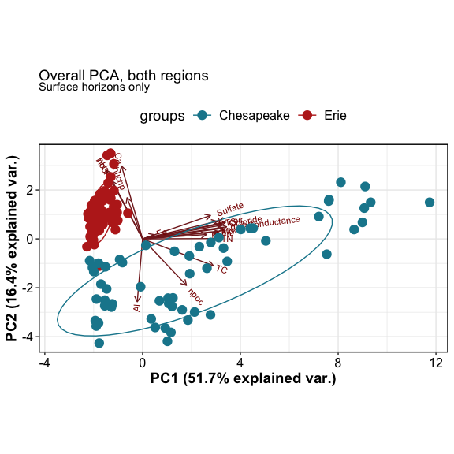

Synpotic Soil Characterization
================

------------------------------------------------------------------------

## OVERALL SUMMARIES

| region | site  | transect   | horizon | DIN | Ferrozine | GWC | ICP | Mehlich3 | NPOC |  PH | TCTNTS |  IC |
|:-------|:------|:-----------|:--------|----:|----------:|----:|----:|---------:|-----:|----:|-------:|----:|
| WLE    | CC    | upland     | A       |   9 |         9 |   9 |   9 |        9 |    9 |   9 |      9 |   9 |
| WLE    | CC    | upland     | B       |   1 |        NA |  NA |   1 |        1 |    1 |  NA |      1 |   1 |
| WLE    | CC    | transition | A       |   9 |         9 |   9 |   9 |        9 |    9 |   9 |      9 |   9 |
| WLE    | CC    | wc         | A       |   9 |         8 |   9 |   9 |        9 |    9 |   9 |      9 |   9 |
| WLE    | OWC   | upland     | A       |   9 |         9 |   9 |   9 |        9 |    9 |   9 |      9 |   9 |
| WLE    | OWC   | upland     | B       |   5 |        NA |   5 |   5 |        5 |    5 |   5 |      5 |   5 |
| WLE    | OWC   | transition | A       |   9 |         9 |   9 |   9 |        9 |    9 |   9 |      8 |   9 |
| WLE    | OWC   | transition | B       |   9 |        NA |   9 |   7 |        9 |    8 |   8 |      9 |   8 |
| WLE    | OWC   | wte        | A       |   9 |         9 |   9 |   9 |        9 |    9 |   9 |      9 |   9 |
| WLE    | OWC   | wc         | A       |   8 |        NA |   8 |   8 |        8 |    8 |   8 |      8 |   8 |
| WLE    | PR    | upland     | A       |   9 |         9 |   9 |   9 |        6 |    9 |   9 |      9 |   9 |
| WLE    | PR    | upland     | B       |   8 |        NA |   8 |   8 |        8 |    8 |   7 |      8 |   8 |
| WLE    | PR    | transition | A       |   9 |         9 |   9 |   9 |        9 |    9 |   9 |      9 |   9 |
| WLE    | PR    | transition | B       |  NA |        NA |   2 |  NA |       NA |   NA |  NA |     NA |  NA |
| WLE    | PR    | wc         | A       |  15 |        15 |  15 |  15 |       15 |   15 |  15 |     15 |  15 |
| CB     | GCREW | upland     | A       |   8 |         8 |   8 |   8 |        8 |    8 |   8 |      8 |  NA |
| CB     | GCREW | upland     | B       |   8 |         5 |   8 |   8 |        8 |    8 |   8 |      8 |  NA |
| CB     | GCREW | transition | A       |   8 |         8 |   8 |   8 |        8 |    8 |   8 |      8 |  NA |
| CB     | GCREW | transition | B       |   8 |         7 |   8 |   8 |        8 |    7 |   8 |      8 |  NA |
| CB     | GCREW | wc         | A       |   8 |         6 |   8 |   7 |        8 |    8 |   8 |      7 |  NA |
| CB     | GWI   | upland     | O       |   8 |         8 |   9 |   8 |        8 |    8 |   8 |      8 |   8 |
| CB     | GWI   | upland     | A       |   8 |         8 |   8 |   8 |        8 |    8 |   8 |      8 |   8 |
| CB     | GWI   | upland     | B       |   2 |         2 |   2 |   2 |        2 |    2 |   2 |      2 |   2 |
| CB     | GWI   | transition | O       |   8 |         8 |   8 |   8 |        8 |    8 |   8 |      5 |   8 |
| CB     | GWI   | transition | A       |   7 |         7 |   8 |   7 |        7 |    7 |   7 |      7 |   7 |
| CB     | GWI   | wc         | O       |   8 |         8 |   8 |   8 |        8 |    8 |   8 |      8 |   8 |
| CB     | MSM   | upland     | O       |   8 |         8 |   8 |   8 |        7 |    8 |   8 |      8 |   8 |
| CB     | MSM   | upland     | A       |   2 |         2 |   2 |   2 |        2 |    2 |   2 |      2 |   2 |
| CB     | MSM   | upland     | B       |   8 |         8 |   8 |   8 |        8 |    8 |   8 |      8 |   8 |
| CB     | MSM   | transition | O       |   8 |         8 |   8 |   8 |        8 |    8 |   8 |      7 |   8 |
| CB     | MSM   | transition | B       |   8 |         8 |   8 |   8 |        8 |    8 |   8 |      8 |   8 |
| CB     | MSM   | wc         | O       |   9 |         9 |   9 |   9 |        9 |    9 |   9 |      9 |   9 |

    ## $gg_pca_overall

<!-- -->

    ## 
    ## $gg_pca_wle

<!-- -->

    ## 
    ## $gg_pca_cb

<!-- -->

    ## $corr_all

<!-- -->

    ## 
    ## $corr_wle

<!-- -->

    ## 
    ## $corr_cb

<!-- -->

------------------------------------------------------------------------

**Gravimetric moisture**

<!-- -->

**Loss on ignition (% organic matter)**

<!-- -->

**pH**

<!-- -->

**specific conductance**

<!-- -->

**total CNS**

    ## $gg_tc

<!-- -->

    ## 
    ## $gg_tn

<!-- -->

    ## 
    ## $gg_ts

<!-- -->

**Water extractable organic C**

<!-- -->

**Extractable inorganic N**

Inorganic N was extracted using 2M KCl

    ## $gg_no3

<!-- -->

    ## 
    ## $gg_nh4

<!-- -->

**ICP results: base cations**

Extracted using 1M NH4Cl

<!-- -->

**ICP results: other cations**

Extracted using 1M NH4Cl

<!-- -->

**ICP results: others**

Extracted using 1M NH4Cl

<!-- -->

**HCl-extractable iron - ferrozine method**

Extracted using 0.5 M HCl

    ## $gg_fe_2_3

<!-- -->

    ## 
    ## $gg_fe_total

<!-- -->

**Mehlich-3 extractable P**

Extracted using Mehlich-3 solution, analyzed with molybdate method

<!-- -->

**FT-ICR-MS**

    ## $vk_domains

<!-- -->

    ## 
    ## $vk_wle

<!-- -->

    ## 
    ## $vk_cb

<!-- -->

    ## $vk_unique_wle

<!-- -->

    ## 
    ## $vk_unique_cb

<!-- -->

<!-- -->

<!-- -->

<!-- -->

------------------------------------------------------------------------

Session Info

Date run: 2022-12-20

    ## R version 4.2.1 (2022-06-23)
    ## Platform: x86_64-apple-darwin17.0 (64-bit)
    ## Running under: macOS Big Sur ... 10.16
    ## 
    ## Matrix products: default
    ## BLAS:   /Library/Frameworks/R.framework/Versions/4.2/Resources/lib/libRblas.0.dylib
    ## LAPACK: /Library/Frameworks/R.framework/Versions/4.2/Resources/lib/libRlapack.dylib
    ## 
    ## locale:
    ## [1] en_US.UTF-8/en_US.UTF-8/en_US.UTF-8/C/en_US.UTF-8/en_US.UTF-8
    ## 
    ## attached base packages:
    ## [1] stats     graphics  grDevices utils     datasets  methods   base     
    ## 
    ## other attached packages:
    ##  [1] patchwork_1.1.2     vegan_2.6-4         lattice_0.20-45    
    ##  [4] permute_0.9-7       ggbiplot_0.55       googlesheets4_1.0.1
    ##  [7] lubridate_1.8.0     soilpalettes_0.1.0  PNWColors_0.1.0    
    ## [10] magrittr_2.0.3      forcats_0.5.2       stringr_1.4.1      
    ## [13] dplyr_1.0.10        purrr_0.3.4         readr_2.1.3        
    ## [16] tidyr_1.2.1         tibble_3.1.8        ggplot2_3.3.6      
    ## [19] tidyverse_1.3.2     tarchetypes_0.7.2   targets_0.14.0     
    ## 
    ## loaded via a namespace (and not attached):
    ##  [1] nlme_3.1-160      fs_1.5.2          httr_1.4.4        tools_4.2.1      
    ##  [5] backports_1.4.1   utf8_1.2.2        R6_2.5.1          DBI_1.1.3        
    ##  [9] mgcv_1.8-40       colorspace_2.0-3  withr_2.5.0       tidyselect_1.1.2 
    ## [13] processx_3.7.0    compiler_4.2.1    cli_3.3.0         rvest_1.0.3      
    ## [17] xml2_1.3.3        labeling_0.4.2    scales_1.2.1      callr_3.7.2      
    ## [21] digest_0.6.29     rmarkdown_2.16    pkgconfig_2.0.3   htmltools_0.5.3  
    ## [25] dbplyr_2.2.1      fastmap_1.1.0     highr_0.9         rlang_1.0.5      
    ## [29] readxl_1.4.1      rstudioapi_0.14   generics_0.1.3    farver_2.1.1     
    ## [33] jsonlite_1.8.0    Matrix_1.5-1      Rcpp_1.0.9        munsell_0.5.0    
    ## [37] fansi_1.0.3       lifecycle_1.0.1   stringi_1.7.8     yaml_2.3.5       
    ## [41] MASS_7.3-57       plyr_1.8.7        grid_4.2.1        parallel_4.2.1   
    ## [45] crayon_1.5.1      haven_2.5.1       splines_4.2.1     hms_1.1.2        
    ## [49] knitr_1.40        ps_1.7.1          pillar_1.8.1      igraph_1.3.4     
    ## [53] base64url_1.4     reshape2_1.4.4    codetools_0.2-18  reprex_2.0.2     
    ## [57] glue_1.6.2        evaluate_0.16     data.table_1.14.4 modelr_0.1.9     
    ## [61] vctrs_0.4.1       tzdb_0.3.0        cellranger_1.1.0  gtable_0.3.0     
    ## [65] assertthat_0.2.1  xfun_0.32         broom_1.0.0       ggcorrplot_0.1.4 
    ## [69] googledrive_2.0.0 gargle_1.2.0      cluster_2.1.3     ellipsis_0.3.2

