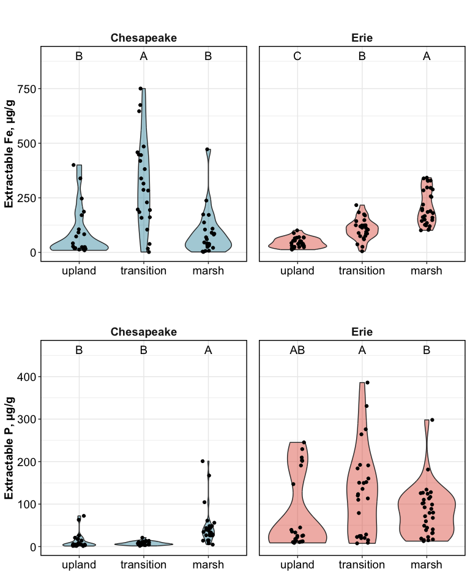
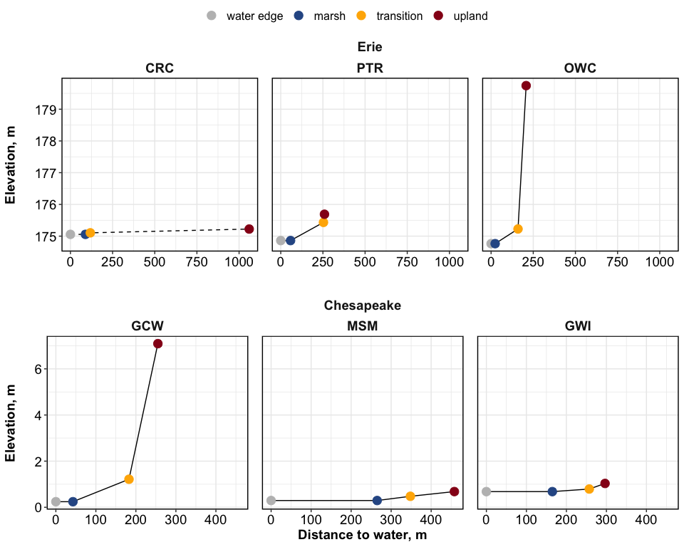

Synpotic Soil Characterization
================

------------------------------------------------------------------------

    ## [1] "df created: `data_combined_wide`, `data_wide_PCA`"

------------------------------------------------------------------------

## Site Map

<!-- -->

------------------------------------------------------------------------

## 0. Correlations

<!-- -->

Highly correlated variables include:

- (+) TC & WEOC, TN
- (+) TS & Chloride, Sulfate, Na, CEC
- (+) CEC & TS, Na, K, Mg, SpConductance
- (+) Na & SpConductance, TS, K, Mg
- (+) Chloride & Sulfate, TS, CEC, SpConductance, Na
- (-) pH & WEOC, Al
- (-) Ca and Al

------------------------------------------------------------------------

# VERSION 1: ALL ANALYTES

Click to Open

## 1. PCAs

------------------------------------------------------------------------

### Overall PCAs

### PCA with clusters

<!-- -->

<!-- -->

### Drivers and loadings

<!-- -->

------------------------------------------------------------------------

## 1b. PERMANOVA

    ## Permutation test for adonis under reduced model
    ## Terms added sequentially (first to last)
    ## Permutation: free
    ## Number of permutations: 999
    ## 
    ## adonis2(formula = (data_wide_PCA %>% dplyr::select(where(is.numeric)) %>% drop_na()) ~ (region + transect + horizon + site)^2, data = data_wide_PCA %>% drop_na)
    ##                   Df SumOfSqs      R2        F Pr(>F)    
    ## region             1   6.4742 0.31664 202.8724  0.001 ***
    ## transect           2   1.9274 0.09427  30.1983  0.001 ***
    ## horizon            1   3.2216 0.15756 100.9508  0.001 ***
    ## site               3   0.8066 0.03945   8.4249  0.001 ***
    ## region:transect    2   1.7024 0.08326  26.6726  0.001 ***
    ## transect:horizon   2   1.2432 0.06080  19.4786  0.001 ***
    ## transect:site      6   1.4648 0.07164   7.6498  0.001 ***
    ## Residual         113   3.6062 0.17637                    
    ## Total            130  20.4464 1.00000                    
    ## ---
    ## Signif. codes:  0 '***' 0.001 '**' 0.01 '*' 0.05 '.' 0.1 ' ' 1

## 2. Each analyte

### Normalized values - v2

<!-- -->

<!-- -->

### GWI only

<!-- -->

# VERSION 2: DROPPING CORRELATED ANALYTES

### Overall PCAs

### PCA with clusters

<!-- -->

------------------------------------------------------------------------

## PCA by region

<!-- -->

### Drivers and loadings

<!-- -->

## 1b. PERMANOVA

    ## Permutation test for adonis under reduced model
    ## Terms added sequentially (first to last)
    ## Permutation: free
    ## Number of permutations: 999
    ## 
    ## adonis2(formula = (data_wide_PCA2 %>% dplyr::select(where(is.numeric)) %>% drop_na()) ~ (region + transect + horizon + site)^2, data = data_wide_PCA2 %>% drop_na)
    ##                   Df SumOfSqs      R2        F Pr(>F)    
    ## region             1   6.0936 0.28817 173.6187  0.001 ***
    ## transect           2   2.0106 0.09508  28.6424  0.001 ***
    ## horizon            1   3.3930 0.16046  96.6727  0.001 ***
    ## site               3   0.8465 0.04003   8.0392  0.001 ***
    ## region:transect    2   1.8128 0.08573  25.8245  0.001 ***
    ## transect:horizon   2   1.1888 0.05622  16.9355  0.001 ***
    ## transect:site      6   1.7645 0.08344   8.3790  0.001 ***
    ## Residual         115   4.0362 0.19088                    
    ## Total            132  21.1459 1.00000                    
    ## ---
    ## Signif. codes:  0 '***' 0.001 '**' 0.01 '*' 0.05 '.' 0.1 ' ' 1

## 2. Each analyte

### Normalized values

### only select analytes

<!-- -->

# Specific analytes

<!-- -->

## Chesapeake-only plots for GWI

<!-- -->

## Water retention curves

<!-- -->

## Elevation

<!-- -->

------------------------------------------------------------------------

## Session Info

Session Info

Date run: 2025-02-20

    ## R version 4.2.1 (2022-06-23)
    ## Platform: x86_64-apple-darwin17.0 (64-bit)
    ## Running under: macOS Big Sur ... 10.16
    ## 
    ## Matrix products: default
    ## BLAS:   /Library/Frameworks/R.framework/Versions/4.2/Resources/lib/libRblas.0.dylib
    ## LAPACK: /Library/Frameworks/R.framework/Versions/4.2/Resources/lib/libRlapack.dylib
    ## 
    ## locale:
    ## [1] en_US.UTF-8/en_US.UTF-8/en_US.UTF-8/C/en_US.UTF-8/en_US.UTF-8
    ## 
    ## attached base packages:
    ## [1] stats     graphics  grDevices utils     datasets  methods   base     
    ## 
    ## other attached packages:
    ##  [1] ggh4x_0.2.8.9000    ggConvexHull_0.1.0  factoextra_1.0.7   
    ##  [4] ggspatial_1.1.9     sf_1.0-8            patchwork_1.1.2    
    ##  [7] vegan_2.6-4         lattice_0.20-45     permute_0.9-7      
    ## [10] ggbiplot_0.55       multcompView_0.1-9  multcomp_1.4-25    
    ## [13] TH.data_1.1-1       MASS_7.3-60         survival_3.3-1     
    ## [16] mvtnorm_1.1-3       googlesheets4_1.0.1 soilpalettes_0.1.0 
    ## [19] PNWColors_0.1.0     magrittr_2.0.3      lubridate_1.9.2    
    ## [22] forcats_1.0.0       stringr_1.5.0       dplyr_1.1.4        
    ## [25] purrr_1.0.2         readr_2.1.4         tidyr_1.3.1        
    ## [28] tibble_3.2.1        ggplot2_3.5.1       tidyverse_2.0.0    
    ## [31] tarchetypes_0.7.2   targets_0.14.0     
    ## 
    ## loaded via a namespace (and not attached):
    ##  [1] minqa_1.2.4        googledrive_2.0.0  colorspace_2.0-3   ggsignif_0.6.4    
    ##  [5] ellipsis_0.3.2     class_7.3-20       fs_1.5.2           rstudioapi_0.16.0 
    ##  [9] proxy_0.4-27       ggpubr_0.6.0       farver_2.1.1       ggrepel_0.9.3     
    ## [13] fansi_1.0.3        codetools_0.2-18   splines_4.2.1      knitr_1.42        
    ## [17] nloptr_2.0.3       broom_1.0.6        cluster_2.1.3      compiler_4.2.1    
    ## [21] backports_1.4.1    ggcorrplot_0.1.4   Matrix_1.5-1       fastmap_1.1.0     
    ## [25] gargle_1.2.0       cli_3.6.3          s2_1.1.0           htmltools_0.5.7   
    ## [29] tools_4.2.1        igraph_1.5.1       gtable_0.3.0       glue_1.6.2        
    ## [33] reshape2_1.4.4     wk_0.6.0           Rcpp_1.0.11        carData_3.0-5     
    ## [37] cellranger_1.1.0   vctrs_0.6.5        nlme_3.1-160       xfun_0.42         
    ## [41] ps_1.7.1           lme4_1.1-31        timechange_0.2.0   lifecycle_1.0.3   
    ## [45] rstatix_0.7.2      zoo_1.8-11         scales_1.3.0       hms_1.1.2         
    ## [49] parallel_4.2.1     sandwich_3.0-2     yaml_2.3.5         gridExtra_2.3     
    ## [53] stringi_1.7.8      highr_0.9          e1071_1.7-11       boot_1.3-28       
    ## [57] rlang_1.1.4.9000   pkgconfig_2.0.3    evaluate_0.16      labeling_0.4.2    
    ## [61] cowplot_1.1.1      processx_3.7.0     tidyselect_1.2.0   plyr_1.8.7        
    ## [65] R6_2.5.1           generics_0.1.3     base64url_1.4      DBI_1.1.3         
    ## [69] pillar_1.9.0       withr_2.5.0        mgcv_1.8-40        units_0.8-0       
    ## [73] abind_1.4-5        car_3.1-0          KernSmooth_2.23-20 utf8_1.2.2        
    ## [77] tzdb_0.4.0         rmarkdown_2.21     grid_4.2.1         data.table_1.14.4 
    ## [81] callr_3.7.2        digest_0.6.29      classInt_0.4-7     munsell_0.5.0

