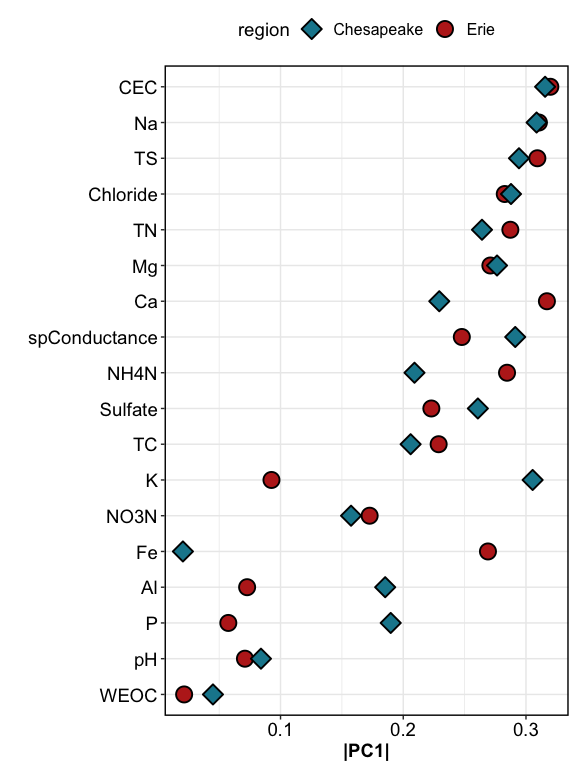
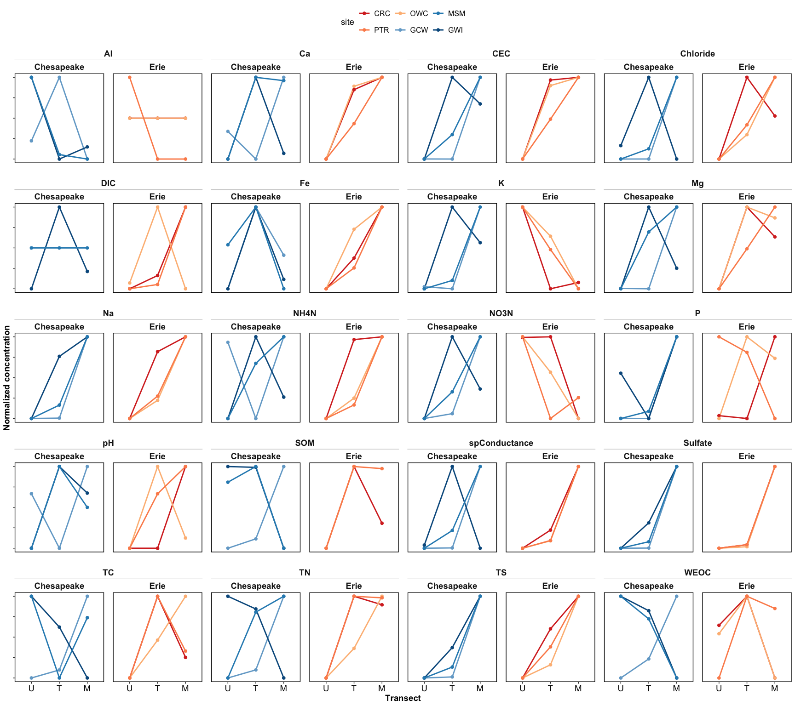
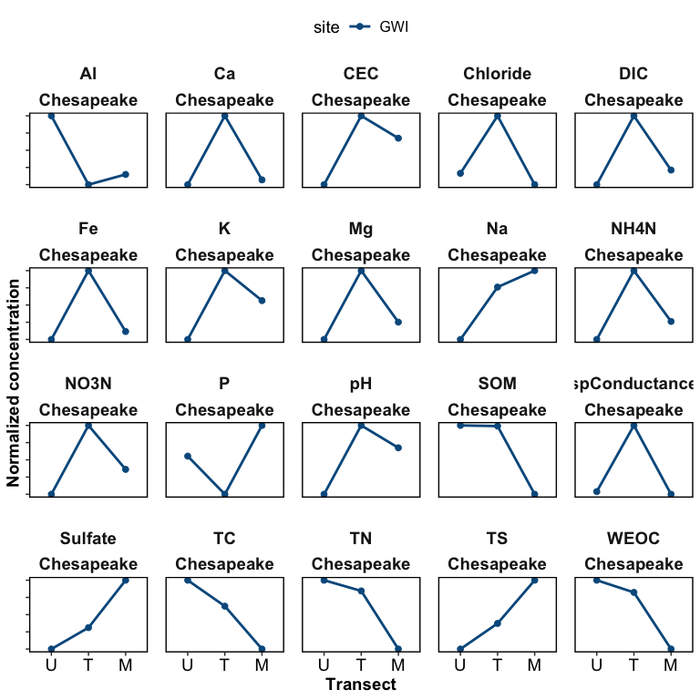
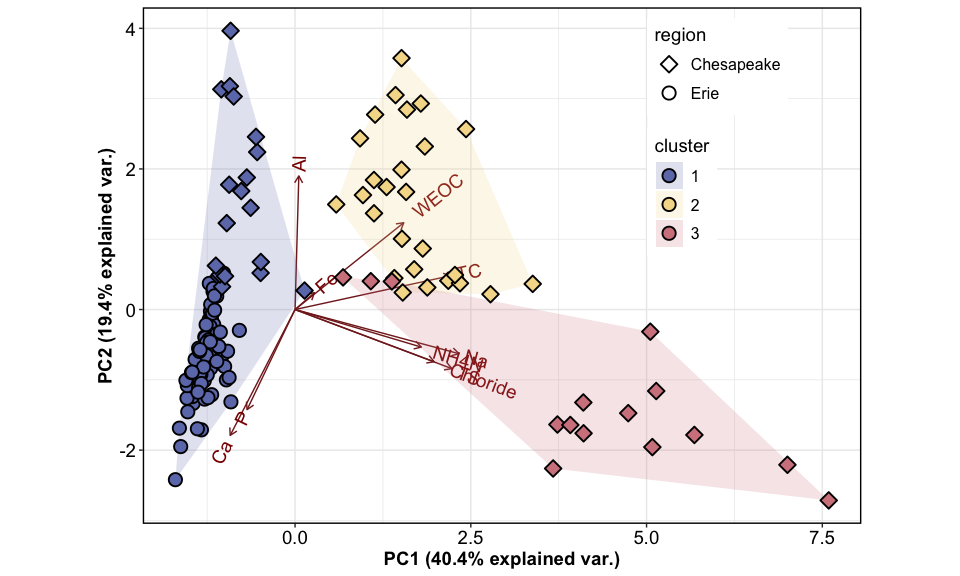

Synpotic Soil Characterization
================

------------------------------------------------------------------------

    ## [1] "df created: `data_combined_wide`, `data_wide_PCA`"

------------------------------------------------------------------------

## Site Map

<!-- -->

------------------------------------------------------------------------

## 0. Correlations

<!-- -->

Highly correlated variables include:

- (+) TC & WEOC, TN
- (+) TS & Chloride, Sulfate, Na, CEC
- (+) CEC & TS, Na, K, Mg, SpConductance
- (+) Na & SpConductance, TS, K, Mg
- (+) Chloride & Sulfate, TS, CEC, SpConductance, Na
- (-) pH & WEOC, Al
- (-) Ca and Al

------------------------------------------------------------------------

# VERSION 1: ALL ANALYTES

Click to Open

## 1. PCAs

------------------------------------------------------------------------

### Overall PCAs

### PCA with clusters

<!-- -->

<!-- -->

### Drivers and loadings

<!-- -->

------------------------------------------------------------------------

## 1b. PERMANOVA

    ## Permutation test for adonis under reduced model
    ## Permutation: free
    ## Number of permutations: 999
    ## 
    ## adonis2(formula = (data_wide_PCA %>% dplyr::select(where(is.numeric)) %>% drop_na()) ~ (region + transect + horizon + site)^2, data = data_wide_PCA %>% drop_na)
    ##           Df SumOfSqs      R2      F Pr(>F)    
    ## Model     17  16.8403 0.82363 31.041  0.001 ***
    ## Residual 113   3.6062 0.17637                  
    ## Total    130  20.4464 1.00000                  
    ## ---
    ## Signif. codes:  0 '***' 0.001 '**' 0.01 '*' 0.05 '.' 0.1 ' ' 1

## 2. Each analyte

### Normalized values - v2

<!-- -->

<!-- -->

### GWI only

<!-- -->

# VERSION 2: DROPPING CORRELATED ANALYTES

### Overall PCAs

### PCA with clusters

<!-- -->

------------------------------------------------------------------------

## PCA by region

<!-- -->

### Drivers and loadings

<!-- -->

## 1b. PERMANOVA

    ## Permutation test for adonis under reduced model
    ## Permutation: free
    ## Number of permutations: 999
    ## 
    ## adonis2(formula = (data_wide_PCA2 %>% dplyr::select(where(is.numeric)) %>% drop_na()) ~ (region + transect + horizon + site)^2, data = data_wide_PCA2 %>% drop_na)
    ##           Df SumOfSqs      R2      F Pr(>F)    
    ## Model     17  17.1096 0.80912 28.676  0.001 ***
    ## Residual 115   4.0362 0.19088                  
    ## Total    132  21.1459 1.00000                  
    ## ---
    ## Signif. codes:  0 '***' 0.001 '**' 0.01 '*' 0.05 '.' 0.1 ' ' 1

## 2. Each analyte

### Normalized values

### only select analytes

<!-- -->

# Specific analytes

<!-- -->

## Chesapeake-only plots for GWI

<!-- -->

## Water retention curves

<!-- -->

## Elevation

<!-- -->

------------------------------------------------------------------------

## Session Info

Session Info

Date run: 2025-07-26

    ## R version 4.5.0 (2025-04-11)
    ## Platform: aarch64-apple-darwin20
    ## Running under: macOS Sequoia 15.5
    ## 
    ## Matrix products: default
    ## BLAS:   /Library/Frameworks/R.framework/Versions/4.5-arm64/Resources/lib/libRblas.0.dylib 
    ## LAPACK: /Library/Frameworks/R.framework/Versions/4.5-arm64/Resources/lib/libRlapack.dylib;  LAPACK version 3.12.1
    ## 
    ## locale:
    ## [1] en_US.UTF-8/en_US.UTF-8/en_US.UTF-8/C/en_US.UTF-8/en_US.UTF-8
    ## 
    ## time zone: America/Los_Angeles
    ## tzcode source: internal
    ## 
    ## attached base packages:
    ## [1] stats     graphics  grDevices utils     datasets  methods   base     
    ## 
    ## other attached packages:
    ##  [1] ggh4x_0.3.1         ggConvexHull_0.1.0  factoextra_1.0.7   
    ##  [4] ggspatial_1.1.9     sf_1.0-21           patchwork_1.3.0    
    ##  [7] vegan_2.7-1         permute_0.9-7       ggbiplot_0.55      
    ## [10] multcompView_0.1-10 multcomp_1.4-28     TH.data_1.1-3      
    ## [13] MASS_7.3-65         survival_3.8-3      mvtnorm_1.3-3      
    ## [16] googlesheets4_1.1.1 soilpalettes_0.1.0  PNWColors_0.1.0    
    ## [19] magrittr_2.0.3      lubridate_1.9.4     forcats_1.0.0      
    ## [22] stringr_1.5.1       dplyr_1.1.4         purrr_1.0.4        
    ## [25] readr_2.1.5         tidyr_1.3.1         tibble_3.3.0       
    ## [28] ggplot2_3.5.2       tidyverse_2.0.0     tarchetypes_0.13.1 
    ## [31] targets_1.11.3     
    ## 
    ## loaded via a namespace (and not attached):
    ##  [1] Rdpack_2.6.4       DBI_1.2.3          gridExtra_2.3      s2_1.1.8          
    ##  [5] sandwich_3.1-1     rlang_1.1.6        e1071_1.7-16       compiler_4.5.0    
    ##  [9] mgcv_1.9-1         callr_3.7.6        vctrs_0.6.5        reshape2_1.4.4    
    ## [13] pkgconfig_2.0.3    wk_0.9.4           fastmap_1.2.0      backports_1.5.0   
    ## [17] labeling_0.4.3     rmarkdown_2.29     tzdb_0.5.0         nloptr_2.2.1      
    ## [21] ps_1.9.1           xfun_0.52          broom_1.0.8        parallel_4.5.0    
    ## [25] prettyunits_1.2.0  cluster_2.1.8.1    R6_2.6.1           stringi_1.8.7     
    ## [29] RColorBrewer_1.1-3 boot_1.3-31        car_3.1-3          cellranger_1.1.0  
    ## [33] Rcpp_1.0.14        knitr_1.50         zoo_1.8-14         Matrix_1.7-3      
    ## [37] splines_4.5.0      igraph_2.1.4       timechange_0.3.0   tidyselect_1.2.1  
    ## [41] rstudioapi_0.17.1  abind_1.4-8        yaml_2.3.10        codetools_0.2-20  
    ## [45] processx_3.8.6     lattice_0.22-6     plyr_1.8.9         withr_3.0.2       
    ## [49] evaluate_1.0.3     units_0.8-7        proxy_0.4-27       pillar_1.10.2     
    ## [53] ggpubr_0.6.0       carData_3.0-5      KernSmooth_2.23-26 reformulas_0.4.1  
    ## [57] generics_0.1.3     hms_1.1.3          scales_1.4.0       minqa_1.2.8       
    ## [61] base64url_1.4      class_7.3-23       glue_1.8.0         tools_4.5.0       
    ## [65] data.table_1.17.0  lme4_1.1-37        ggsignif_0.6.4     fs_1.6.6          
    ## [69] cowplot_1.1.3      grid_4.5.0         rbibutils_2.3      nlme_3.1-168      
    ## [73] googledrive_2.1.1  Formula_1.2-5      cli_3.6.5          gargle_1.5.2      
    ## [77] gtable_0.3.6       ggcorrplot_0.1.4.1 rstatix_0.7.2      digest_0.6.37     
    ## [81] classInt_0.4-11    ggrepel_0.9.6      farver_2.1.2       htmltools_0.5.8.1 
    ## [85] lifecycle_1.0.4    secretbase_1.0.5

