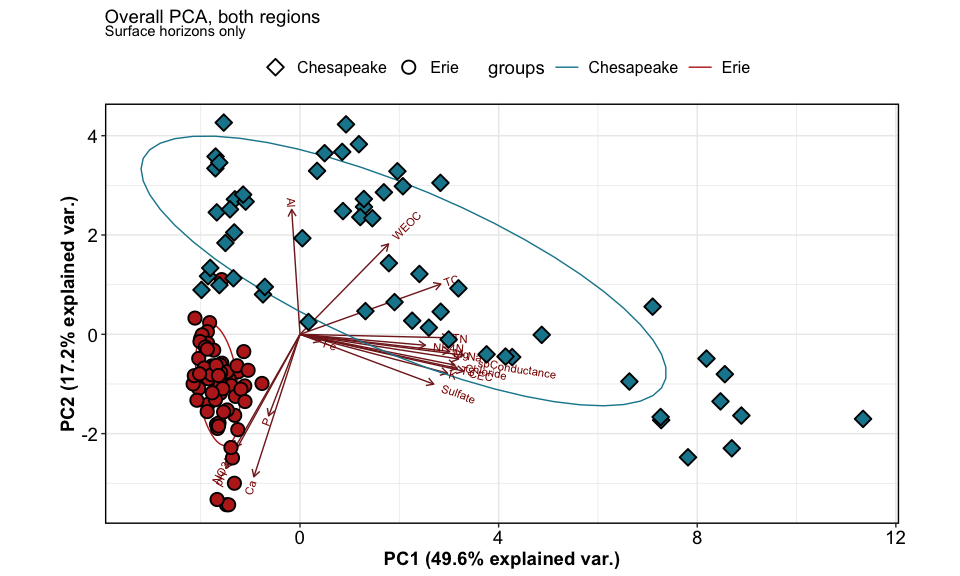
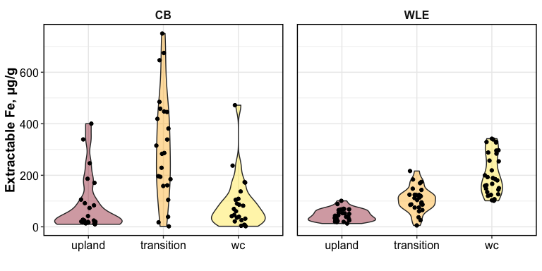

Synpotic Soil Characterization
================

------------------------------------------------------------------------

    ## [1] "df created: `data_combined_wide`, `data_wide_PCA`"

------------------------------------------------------------------------

## 1. PCAs

------------------------------------------------------------------------

### Overall PCAs

<!-- -->

<!-- -->

### Drivers and loadings

<!-- -->

### Clustering

<!-- -->

### PCA with clusters

<!-- -->

------------------------------------------------------------------------

## 1b. PERMANOVA

    ## Permutation test for adonis under reduced model
    ## Terms added sequentially (first to last)
    ## Permutation: free
    ## Number of permutations: 999
    ## 
    ## adonis2(formula = (data_wide_PCA %>% dplyr::select(where(is.numeric)) %>% drop_na()) ~ (region + transect + horizon + site)^2, data = data_wide_PCA %>% drop_na)
    ##                   Df SumOfSqs      R2        F Pr(>F)    
    ## region             1   6.4742 0.31664 202.8724  0.001 ***
    ## transect           2   1.9274 0.09427  30.1983  0.001 ***
    ## horizon            1   3.2216 0.15756 100.9508  0.001 ***
    ## site               3   0.8066 0.03945   8.4249  0.001 ***
    ## region:transect    2   1.7024 0.08326  26.6726  0.001 ***
    ## transect:horizon   2   1.2432 0.06080  19.4786  0.001 ***
    ## transect:site      6   1.4648 0.07164   7.6498  0.001 ***
    ## Residual         113   3.6062 0.17637                    
    ## Total            130  20.4464 1.00000                    
    ## ---
    ## Signif. codes:  0 '***' 0.001 '**' 0.01 '*' 0.05 '.' 0.1 ' ' 1

## 2. Each analyte

### Normalized values - v1

<!-- -->

### Normalized values - v2

<!-- -->

<!-- -->

### GWI only

<!-- -->

### Specific analytes

<!-- --><!-- -->

------------------------------------------------------------------------

## Session Info

Session Info

Date run: 2024-08-20

    ## R version 4.2.1 (2022-06-23)
    ## Platform: x86_64-apple-darwin17.0 (64-bit)
    ## Running under: macOS Big Sur ... 10.16
    ## 
    ## Matrix products: default
    ## BLAS:   /Library/Frameworks/R.framework/Versions/4.2/Resources/lib/libRblas.0.dylib
    ## LAPACK: /Library/Frameworks/R.framework/Versions/4.2/Resources/lib/libRlapack.dylib
    ## 
    ## locale:
    ## [1] en_US.UTF-8/en_US.UTF-8/en_US.UTF-8/C/en_US.UTF-8/en_US.UTF-8
    ## 
    ## attached base packages:
    ## [1] stats     graphics  grDevices utils     datasets  methods   base     
    ## 
    ## other attached packages:
    ##  [1] ggh4x_0.2.8.9000    vegan_2.6-4         lattice_0.20-45    
    ##  [4] permute_0.9-7       ggConvexHull_0.1.0  factoextra_1.0.7   
    ##  [7] cluster_2.1.3       ggbiplot_0.55       googlesheets4_1.0.1
    ## [10] soilpalettes_0.1.0  PNWColors_0.1.0     magrittr_2.0.3     
    ## [13] lubridate_1.9.2     forcats_1.0.0       stringr_1.5.0      
    ## [16] dplyr_1.1.4         purrr_1.0.2         readr_2.1.4        
    ## [19] tidyr_1.3.1         tibble_3.2.1        ggplot2_3.5.1      
    ## [22] tidyverse_2.0.0    
    ## 
    ## loaded via a namespace (and not attached):
    ##  [1] splines_4.2.1     carData_3.0-5     highr_0.9         base64url_1.4    
    ##  [5] cellranger_1.1.0  yaml_2.3.5        ggrepel_0.9.3     pillar_1.9.0     
    ##  [9] backports_1.4.1   glue_1.6.2        digest_0.6.29     ggsignif_0.6.4   
    ## [13] colorspace_2.0-3  Matrix_1.5-1      cowplot_1.1.1     htmltools_0.5.7  
    ## [17] plyr_1.8.7        pkgconfig_2.0.3   broom_1.0.6       scales_1.3.0     
    ## [21] processx_3.7.0    tzdb_0.4.0        timechange_0.2.0  googledrive_2.0.0
    ## [25] mgcv_1.8-40       generics_0.1.3    farver_2.1.1      car_3.1-0        
    ## [29] ellipsis_0.3.2    ggpubr_0.6.0      withr_2.5.0       cli_3.6.3        
    ## [33] evaluate_0.16     ps_1.7.1          fs_1.5.2          fansi_1.0.3      
    ## [37] nlme_3.1-160      MASS_7.3-60       rstatix_0.7.2     tools_4.2.1      
    ## [41] data.table_1.14.4 hms_1.1.2         gargle_1.2.0      lifecycle_1.0.3  
    ## [45] munsell_0.5.0     targets_0.14.0    callr_3.7.2       compiler_4.2.1   
    ## [49] rlang_1.1.4.9000  grid_4.2.1        rstudioapi_0.16.0 igraph_1.5.1     
    ## [53] labeling_0.4.2    rmarkdown_2.21    gtable_0.3.0      codetools_0.2-18 
    ## [57] abind_1.4-5       R6_2.5.1          knitr_1.42        fastmap_1.1.0    
    ## [61] utf8_1.2.2        stringi_1.7.8     parallel_4.2.1    Rcpp_1.0.11      
    ## [65] vctrs_0.6.5       tidyselect_1.2.0  xfun_0.42

