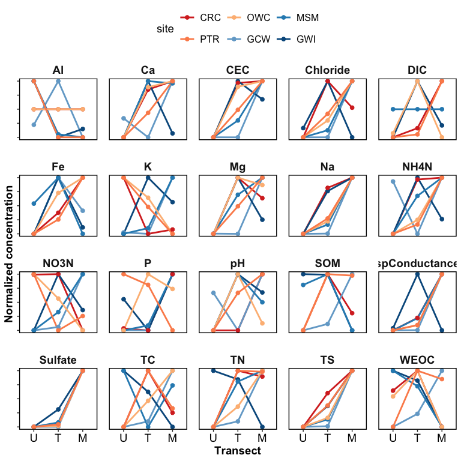

Synpotic Soil Characterization
================

------------------------------------------------------------------------

    ## [1] "df created: `data_combined_wide`, `data_wide_PCA`"

------------------------------------------------------------------------

## 1. PCAs

------------------------------------------------------------------------

### Overall PCAs

<!-- -->

<!-- -->

### Drivers and loadings

<!-- -->

### Clustering

<!-- -->

### PCA with clusters

<!-- -->

------------------------------------------------------------------------

## 2. Each analyte

### Normalized values - v1

<!-- -->

### Normalized values - v2

<!-- -->

<!-- -->

### GWI only

<!-- -->

### Specific analytes

<!-- --><!-- -->

------------------------------------------------------------------------

## Session Info

Session Info

Date run: 2024-07-29

    ## R version 4.2.1 (2022-06-23)
    ## Platform: x86_64-apple-darwin17.0 (64-bit)
    ## Running under: macOS Big Sur ... 10.16
    ## 
    ## Matrix products: default
    ## BLAS:   /Library/Frameworks/R.framework/Versions/4.2/Resources/lib/libRblas.0.dylib
    ## LAPACK: /Library/Frameworks/R.framework/Versions/4.2/Resources/lib/libRlapack.dylib
    ## 
    ## locale:
    ## [1] en_US.UTF-8/en_US.UTF-8/en_US.UTF-8/C/en_US.UTF-8/en_US.UTF-8
    ## 
    ## attached base packages:
    ## [1] stats     graphics  grDevices utils     datasets  methods   base     
    ## 
    ## other attached packages:
    ##  [1] ggConvexHull_0.1.0  factoextra_1.0.7    cluster_2.1.3      
    ##  [4] ggbiplot_0.55       googlesheets4_1.0.1 soilpalettes_0.1.0 
    ##  [7] PNWColors_0.1.0     magrittr_2.0.3      lubridate_1.9.2    
    ## [10] forcats_1.0.0       stringr_1.5.0       dplyr_1.1.0        
    ## [13] purrr_1.0.1         readr_2.1.4         tidyr_1.3.0        
    ## [16] tibble_3.1.8        ggplot2_3.4.3       tidyverse_2.0.0    
    ## 
    ## loaded via a namespace (and not attached):
    ##  [1] ggrepel_0.9.3     Rcpp_1.0.11       ps_1.7.1          digest_0.6.29    
    ##  [5] utf8_1.2.2        R6_2.5.1          cellranger_1.1.0  plyr_1.8.7       
    ##  [9] backports_1.4.1   evaluate_0.16     highr_0.9         pillar_1.8.1     
    ## [13] rlang_1.1.1       rstudioapi_0.14   data.table_1.14.4 car_3.1-0        
    ## [17] callr_3.7.2       rmarkdown_2.21    labeling_0.4.2    googledrive_2.0.0
    ## [21] igraph_1.5.1      munsell_0.5.0     broom_1.0.3       compiler_4.2.1   
    ## [25] xfun_0.42         pkgconfig_2.0.3   htmltools_0.5.7   tidyselect_1.2.0 
    ## [29] codetools_0.2-18  fansi_1.0.3       tzdb_0.3.0        withr_2.5.0      
    ## [33] ggpubr_0.6.0      grid_4.2.1        gtable_0.3.0      lifecycle_1.0.3  
    ## [37] scales_1.2.1      carData_3.0-5     cli_3.6.0         stringi_1.7.8    
    ## [41] farver_2.1.1      ggsignif_0.6.4    fs_1.5.2          ellipsis_0.3.2   
    ## [45] targets_0.14.0    generics_0.1.3    vctrs_0.5.2       cowplot_1.1.1    
    ## [49] tools_4.2.1       glue_1.6.2        hms_1.1.2         abind_1.4-5      
    ## [53] processx_3.7.0    fastmap_1.1.0     yaml_2.3.5        timechange_0.2.0 
    ## [57] colorspace_2.0-3  gargle_1.2.0      base64url_1.4     rstatix_0.7.2    
    ## [61] knitr_1.42

