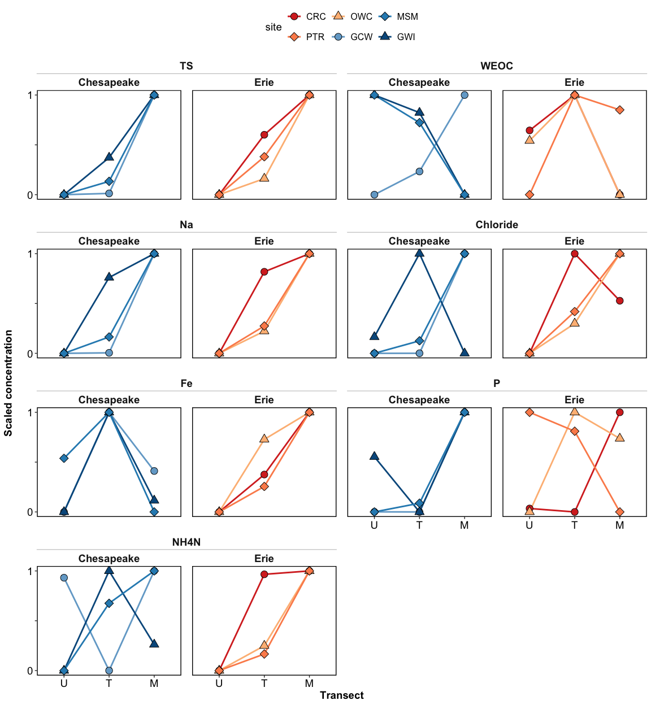
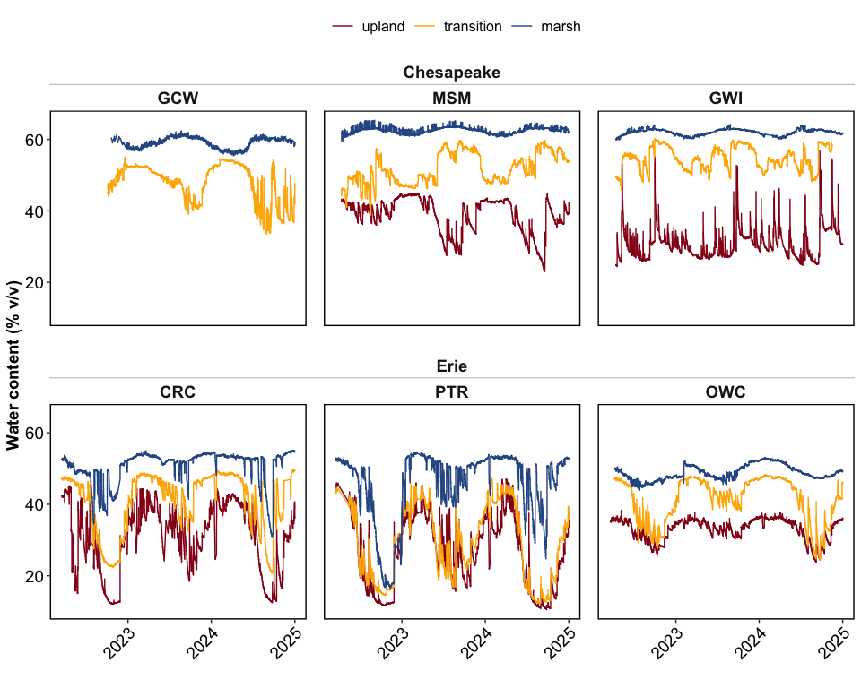

Synpotic Soil Characterization
================

------------------------------------------------------------------------

    ## [1] "df created: `data_combined_wide`, `data_wide_PCA`"

------------------------------------------------------------------------

## Site Map

<!-- -->

------------------------------------------------------------------------

## 0. Correlations

<!-- -->

Highly correlated variables include:

- (+) TC & WEOC, TN
- (+) TS & Chloride, Sulfate, Na, CEC
- (+) CEC & TS, Na, K, Mg, SpConductance
- (+) Na & SpConductance, TS, K, Mg
- (+) Chloride & Sulfate, TS, CEC, SpConductance, Na
- (-) pH & WEOC, Al
- (-) Ca and Al

------------------------------------------------------------------------

# VERSION 1: ALL ANALYTES

Click to Open

## 1. PCAs

------------------------------------------------------------------------

### Overall PCAs

### PCA with clusters

<!-- -->

<!-- -->

### Drivers and loadings

<!-- -->

------------------------------------------------------------------------

## 1b. PERMANOVA

    ## Permutation test for adonis under reduced model
    ## Permutation: free
    ## Number of permutations: 999
    ## 
    ## adonis2(formula = (data_wide_PCA %>% dplyr::select(where(is.numeric)) %>% drop_na()) ~ (region + transect + horizon + site)^2, data = data_wide_PCA %>% drop_na)
    ##           Df SumOfSqs      R2      F Pr(>F)    
    ## Model     17  16.8403 0.82363 31.041  0.001 ***
    ## Residual 113   3.6062 0.17637                  
    ## Total    130  20.4464 1.00000                  
    ## ---
    ## Signif. codes:  0 '***' 0.001 '**' 0.01 '*' 0.05 '.' 0.1 ' ' 1

## 2. Each analyte

### Normalized values - v2

<!-- -->

<!-- -->

### GWI only

<!-- -->

# VERSION 2: DROPPING CORRELATED ANALYTES

### Overall PCAs

### PCA with clusters

<!-- -->

------------------------------------------------------------------------

## PCA by region

<!-- -->

### Drivers and loadings

<!-- -->

## 1b. PERMANOVA

    ## Permutation test for adonis under reduced model
    ## Permutation: free
    ## Number of permutations: 999
    ## 
    ## adonis2(formula = (data_wide_PCA2 %>% dplyr::select(where(is.numeric)) %>% drop_na()) ~ (region + transect + horizon + site)^2, data = data_wide_PCA2 %>% drop_na)
    ##           Df SumOfSqs      R2      F Pr(>F)    
    ## Model     17  17.1096 0.80912 28.676  0.001 ***
    ## Residual 115   4.0362 0.19088                  
    ## Total    132  21.1459 1.00000                  
    ## ---
    ## Signif. codes:  0 '***' 0.001 '**' 0.01 '*' 0.05 '.' 0.1 ' ' 1

## 2. Each analyte

### Normalized values

### only select analytes

<!-- -->

# Specific analytes

<!-- -->

## Chesapeake-only plots for GWI

<!-- -->

## Water retention curves

<!-- -->

## Elevation

<!-- -->

------------------------------------------------------------------------

## SOIL MOISTURE SENSORS

Processed data are available here in this repository. Raw data are
available on Google Drive (access needed).

### Soil water content for 2022-23

    ## [1] "2022-24"

<!-- -->

    ## [1] "Jan-Dec 2023"

<!-- -->

### Summarized soil water content

| region     | site | transect   | mean_vwc | sd_vwc | median_vwc |
|:-----------|:-----|:-----------|---------:|-------:|-----------:|
| Erie       | CRC  | upland     |    33.14 |   5.82 |      33.97 |
| Erie       | CRC  | transition |    44.25 |   4.18 |      46.05 |
| Erie       | CRC  | marsh      |    52.61 |   1.79 |      53.07 |
| Erie       | PTR  | upland     |    29.79 |   6.92 |      30.72 |
| Erie       | PTR  | transition |    31.53 |   7.58 |      31.48 |
| Erie       | PTR  | marsh      |    49.54 |   4.25 |      51.10 |
| Erie       | OWC  | upland     |    34.01 |   1.59 |      34.34 |
| Erie       | OWC  | transition |    44.08 |   2.79 |      44.57 |
| Erie       | OWC  | marsh      |    49.25 |   1.78 |      49.16 |
| Chesapeake | GCW  | transition |    48.29 |   3.90 |      49.05 |
| Chesapeake | GCW  | marsh      |    59.52 |   1.32 |      59.61 |
| Chesapeake | MSM  | upland     |    38.46 |   5.47 |      40.50 |
| Chesapeake | MSM  | transition |    52.90 |   4.65 |      54.83 |
| Chesapeake | MSM  | marsh      |    62.78 |   0.79 |      62.88 |
| Chesapeake | GWI  | upland     |    30.26 |   3.36 |      29.50 |
| Chesapeake | GWI  | transition |    55.01 |   2.97 |      54.82 |
| Chesapeake | GWI  | marsh      |    61.97 |   0.89 |      62.17 |

### Water level in soil

When water level is positive (above surface), it means the soil is
flooded.

    ## [1] "2022-24"

<!-- -->

    ## [1] "Jan-Dec 2023"

<!-- -->

### Water table summary

    ## [1] "Jan-Dec 2023"

| region     | site | transect   | mean_wl | sd_wl | median_wl | min_wl | max_wl |
|:-----------|:-----|:-----------|--------:|------:|----------:|-------:|-------:|
| Chesapeake | GCW  | upland     |   -4.08 |  0.25 |     -4.11 |  -4.36 |  -2.80 |
| Chesapeake | GCW  | transition |   -0.46 |  0.06 |     -0.45 |  -1.17 |  -0.07 |
| Chesapeake | GCW  | marsh      |   -0.09 |  0.07 |     -0.10 |  -0.85 |   0.44 |
| Chesapeake | MSM  | upland     |   -0.29 |  0.22 |     -0.20 |  -0.63 |   0.06 |
| Chesapeake | MSM  | transition |   -0.08 |  0.05 |     -0.08 |  -0.78 |   0.33 |
| Chesapeake | MSM  | marsh      |   -0.08 |  0.09 |     -0.08 |  -0.61 |   0.43 |
| Chesapeake | GWI  | upland     |   -0.50 |  0.14 |     -0.49 |  -1.00 |   0.02 |
| Chesapeake | GWI  | transition |   -0.15 |  0.08 |     -0.13 |  -0.55 |   0.36 |
| Chesapeake | GWI  | marsh      |   -0.04 |  0.07 |     -0.02 |  -0.40 |   0.55 |
| Erie       | CRC  | upland     |   -3.06 |  1.07 |     -3.15 |  -4.91 |  -0.50 |
| Erie       | CRC  | transition |   -0.21 |  0.13 |     -0.19 |  -1.34 |   0.42 |
| Erie       | CRC  | marsh      |   -0.02 |  0.10 |      0.01 |  -0.38 |   0.66 |
| Erie       | PTR  | upland     |   -2.19 |  1.33 |     -1.97 |  -4.36 |  -0.29 |
| Erie       | PTR  | transition |   -0.73 |  0.47 |     -0.64 |  -2.08 |  -0.02 |
| Erie       | PTR  | marsh      |   -0.28 |  0.10 |     -0.26 |  -0.97 |   0.27 |
| Erie       | OWC  | transition |    0.02 |  0.05 |      0.00 |  -0.03 |   0.21 |
| Erie       | OWC  | marsh      |   -0.03 |  0.12 |     -0.06 |  -0.35 |   0.88 |

### Calculating time flooded (% of the year)

    ## [1] "Jan-Dec 2023"

| region     | site | transect   | percent_flooded |
|:-----------|:-----|:-----------|----------------:|
| Chesapeake | GCW  | upland     |            0.00 |
| Chesapeake | GCW  | transition |            0.00 |
| Chesapeake | GCW  | marsh      |            7.77 |
| Chesapeake | MSM  | upland     |            1.38 |
| Chesapeake | MSM  | transition |            3.90 |
| Chesapeake | MSM  | marsh      |           12.97 |
| Chesapeake | GWI  | upland     |            0.02 |
| Chesapeake | GWI  | transition |            0.88 |
| Chesapeake | GWI  | marsh      |            8.08 |
| Erie       | CRC  | upland     |            0.00 |
| Erie       | CRC  | transition |            0.93 |
| Erie       | CRC  | marsh      |           57.96 |
| Erie       | PTR  | upland     |            0.00 |
| Erie       | PTR  | transition |            0.00 |
| Erie       | PTR  | marsh      |            0.19 |
| Erie       | OWC  | transition |           52.17 |
| Erie       | OWC  | marsh      |           25.68 |

------------------------------------------------------------------------

## Session Info

Session Info

Date run: 2025-09-14

    ## R version 4.5.0 (2025-04-11)
    ## Platform: aarch64-apple-darwin20
    ## Running under: macOS Sequoia 15.6.1
    ## 
    ## Matrix products: default
    ## BLAS:   /Library/Frameworks/R.framework/Versions/4.5-arm64/Resources/lib/libRblas.0.dylib 
    ## LAPACK: /Library/Frameworks/R.framework/Versions/4.5-arm64/Resources/lib/libRlapack.dylib;  LAPACK version 3.12.1
    ## 
    ## locale:
    ## [1] en_US.UTF-8/en_US.UTF-8/en_US.UTF-8/C/en_US.UTF-8/en_US.UTF-8
    ## 
    ## time zone: America/Los_Angeles
    ## tzcode source: internal
    ## 
    ## attached base packages:
    ## [1] stats     graphics  grDevices utils     datasets  methods   base     
    ## 
    ## other attached packages:
    ##  [1] multcomp_1.4-28     TH.data_1.1-3       MASS_7.3-65        
    ##  [4] survival_3.8-3      mvtnorm_1.3-3       vegan_2.7-1        
    ##  [7] permute_0.9-7       ggConvexHull_0.1.0  factoextra_1.0.7   
    ## [10] ggspatial_1.1.9     sf_1.0-21           ggh4x_0.3.1        
    ## [13] ggbiplot_0.55       furrr_0.3.1         future_1.58.0      
    ## [16] googledrive_2.1.1   beepr_2.0           tictoc_1.2.1       
    ## [19] cowplot_1.1.3       parsedate_1.3.2     janitor_2.2.1      
    ## [22] pacman_0.5.1        googlesheets4_1.1.1 soilpalettes_0.1.0 
    ## [25] PNWColors_0.1.0     magrittr_2.0.3      lubridate_1.9.4    
    ## [28] forcats_1.0.0       stringr_1.5.1       dplyr_1.1.4        
    ## [31] purrr_1.0.4         readr_2.1.5         tidyr_1.3.1        
    ## [34] tibble_3.3.0        ggplot2_3.5.2       tidyverse_2.0.0    
    ## [37] tarchetypes_0.13.1  targets_1.11.3     
    ## 
    ## loaded via a namespace (and not attached):
    ##  [1] Rdpack_2.6.4       DBI_1.2.3          gridExtra_2.3      s2_1.1.8          
    ##  [5] sandwich_3.1-1     rlang_1.1.6        snakecase_0.11.1   e1071_1.7-16      
    ##  [9] compiler_4.5.0     mgcv_1.9-1         callr_3.7.6        vctrs_0.6.5       
    ## [13] reshape2_1.4.4     pkgconfig_2.0.3    wk_0.9.4           fastmap_1.2.0     
    ## [17] backports_1.5.0    labeling_0.4.3     rmarkdown_2.29     tzdb_0.5.0        
    ## [21] nloptr_2.2.1       ps_1.9.1           xfun_0.52          broom_1.0.8       
    ## [25] parallel_4.5.0     prettyunits_1.2.0  cluster_2.1.8.1    R6_2.6.1          
    ## [29] stringi_1.8.7      RColorBrewer_1.1-3 boot_1.3-31        parallelly_1.45.1 
    ## [33] car_3.1-3          cellranger_1.1.0   Rcpp_1.0.14        knitr_1.50        
    ## [37] zoo_1.8-14         audio_0.1-11       Matrix_1.7-3       splines_4.5.0     
    ## [41] igraph_2.1.4       timechange_0.3.0   tidyselect_1.2.1   rstudioapi_0.17.1 
    ## [45] abind_1.4-8        yaml_2.3.10        codetools_0.2-20   processx_3.8.6    
    ## [49] listenv_0.9.1      lattice_0.22-6     plyr_1.8.9         withr_3.0.2       
    ## [53] evaluate_1.0.3     units_0.8-7        proxy_0.4-27       pillar_1.10.2     
    ## [57] ggpubr_0.6.0       carData_3.0-5      KernSmooth_2.23-26 reformulas_0.4.1  
    ## [61] generics_0.1.3     hms_1.1.3          scales_1.4.0       minqa_1.2.8       
    ## [65] globals_0.18.0     base64url_1.4      class_7.3-23       glue_1.8.0        
    ## [69] tools_4.5.0        data.table_1.17.0  lme4_1.1-37        ggsignif_0.6.4    
    ## [73] fs_1.6.6           grid_4.5.0         rbibutils_2.3      nlme_3.1-168      
    ## [77] Formula_1.2-5      cli_3.6.5          gargle_1.5.2       gtable_0.3.6      
    ## [81] ggcorrplot_0.1.4.1 rstatix_0.7.2      digest_0.6.37      classInt_0.4-11   
    ## [85] ggrepel_0.9.6      farver_2.1.2       htmltools_0.5.8.1  lifecycle_1.0.4   
    ## [89] secretbase_1.0.5

