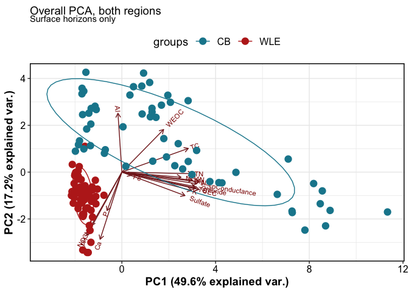
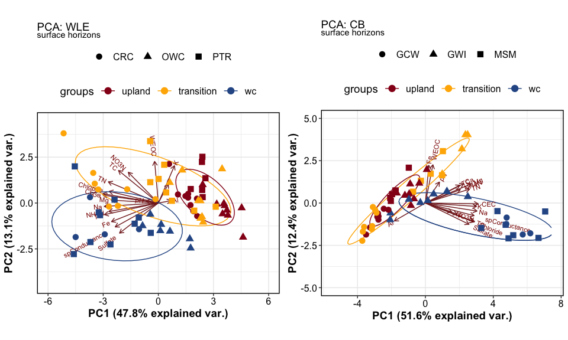
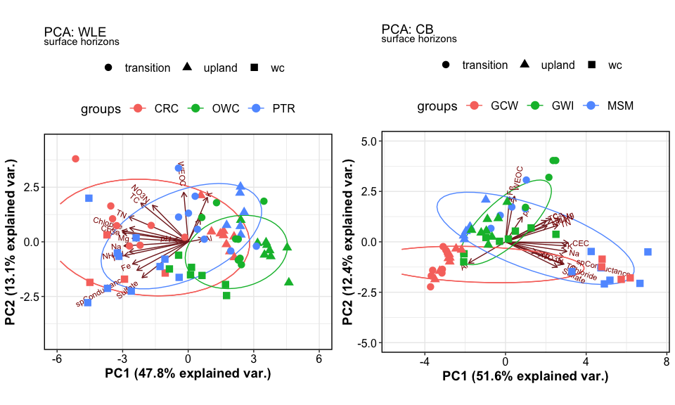
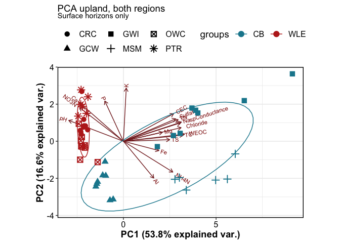
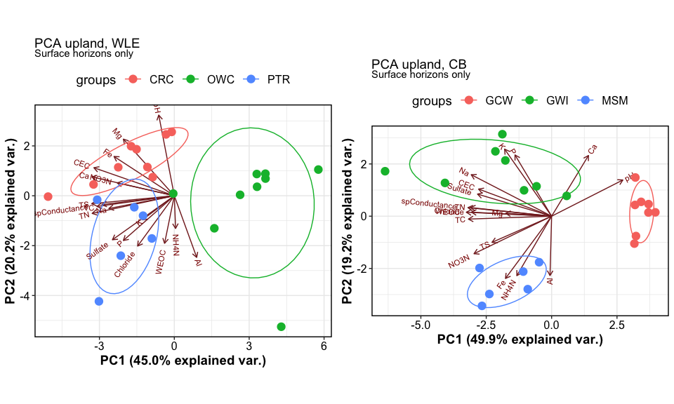
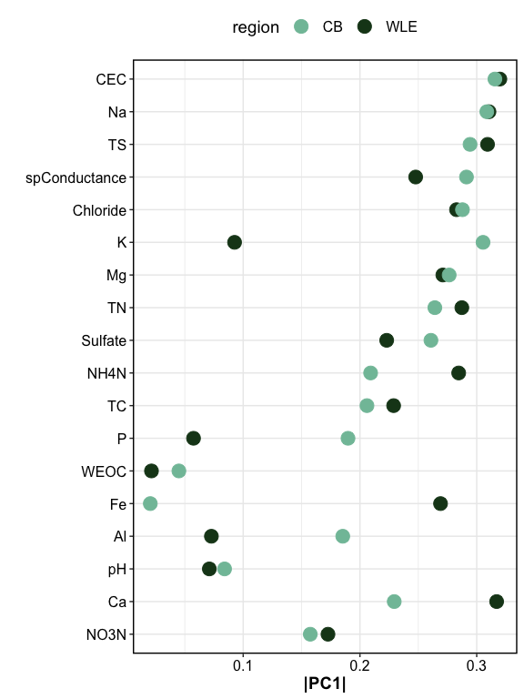

Playing with PCAs
================

------------------------------------------------------------------------

## OVERALL

<!-- -->

### regions separated - colored by transect

<!-- -->

### regions separated - colored by site

<!-- -->

------------------------------------------------------------------------

## BY TRANSECT

<!-- --><!-- --><!-- -->

------------------------------------------------------------------------

## BY TRANSECT + REGION

<!-- -->

<!-- -->

<!-- -->

------------------------------------------------------------------------

## Plotting PC1 (drivers of variability)

<!-- --><!-- -->

------------------------------------------------------------------------

## Session Info

Session Info

Date run: 2023-12-05

    ## R version 4.2.1 (2022-06-23)
    ## Platform: x86_64-apple-darwin17.0 (64-bit)
    ## Running under: macOS Big Sur ... 10.16
    ## 
    ## Matrix products: default
    ## BLAS:   /Library/Frameworks/R.framework/Versions/4.2/Resources/lib/libRblas.0.dylib
    ## LAPACK: /Library/Frameworks/R.framework/Versions/4.2/Resources/lib/libRlapack.dylib
    ## 
    ## locale:
    ## [1] en_US.UTF-8/en_US.UTF-8/en_US.UTF-8/C/en_US.UTF-8/en_US.UTF-8
    ## 
    ## attached base packages:
    ## [1] stats     graphics  grDevices utils     datasets  methods   base     
    ## 
    ## other attached packages:
    ##  [1] ggbiplot_0.55       googlesheets4_1.0.1 soilpalettes_0.1.0 
    ##  [4] PNWColors_0.1.0     magrittr_2.0.3      lubridate_1.9.2    
    ##  [7] forcats_1.0.0       stringr_1.5.0       dplyr_1.1.0        
    ## [10] purrr_1.0.1         readr_2.1.4         tidyr_1.3.0        
    ## [13] tibble_3.1.8        ggplot2_3.4.3       tidyverse_2.0.0    
    ## 
    ## loaded via a namespace (and not attached):
    ##  [1] Rcpp_1.0.11        lattice_0.20-45    ps_1.7.1           digest_0.6.29     
    ##  [5] utf8_1.2.2         R6_2.5.1           cellranger_1.1.0   plyr_1.8.7        
    ##  [9] backports_1.4.1    ggcorrplot_0.1.4   evaluate_0.16      highr_0.9         
    ## [13] pillar_1.8.1       rlang_1.1.1        compositions_2.0-4 rstudioapi_0.14   
    ## [17] data.table_1.14.4  callr_3.7.2        hexbin_1.28.2      rmarkdown_2.21    
    ## [21] labeling_0.4.2     proto_1.0.0        googledrive_2.0.0  igraph_1.3.4      
    ## [25] munsell_0.5.0      compiler_4.2.1     xfun_0.37          pkgconfig_2.0.3   
    ## [29] htmltools_0.5.3    tidyselect_1.2.0   tensorA_0.36.2     gridExtra_2.3     
    ## [33] codetools_0.2-18   fansi_1.0.3        tzdb_0.3.0         withr_2.5.0       
    ## [37] MASS_7.3-60        grid_4.2.1         bayesm_3.1-4       gtable_0.3.0      
    ## [41] lifecycle_1.0.3    scales_1.2.1       cli_3.6.0          stringi_1.7.8     
    ## [45] farver_2.1.1       fs_1.5.2           robustbase_0.95-0  ellipsis_0.3.2    
    ## [49] targets_0.14.0     generics_0.1.3     vctrs_0.5.2        latex2exp_0.9.6   
    ## [53] cowplot_1.1.1      tools_4.2.1        glue_1.6.2         DEoptimR_1.0-11   
    ## [57] hms_1.1.2          processx_3.7.0     fastmap_1.1.0      yaml_2.3.5        
    ## [61] timechange_0.2.0   colorspace_2.0-3   gargle_1.2.0       base64url_1.4     
    ## [65] knitr_1.42         ggtern_3.4.1

